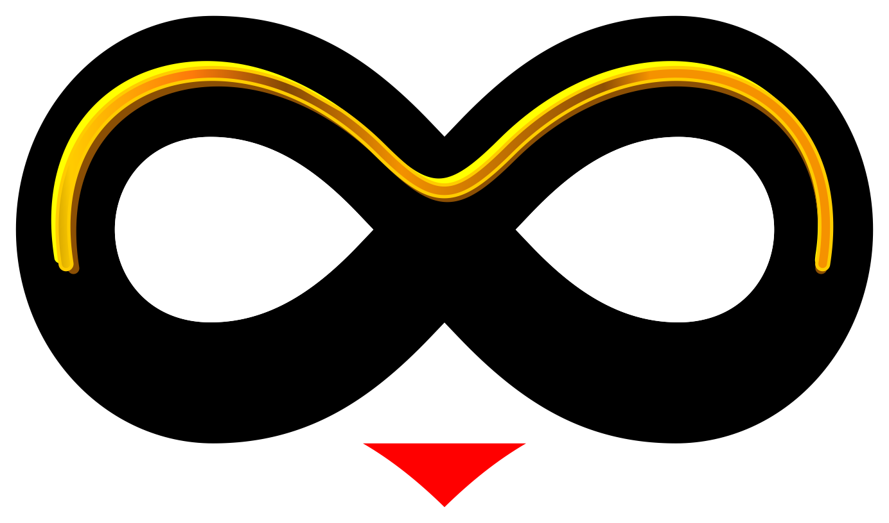

# ArtViSiON 2.0

**Offline PDF converter · photo vectorizer · RGB–CMYK color lab**  
by **RJ Sarkar/Designer**



ArtViSiON is a local web studio for print designers. It never uploads your files to the cloud. Run it on your computer, open `http://127.0.0.1:5000`, drop files, download print-ready output.

## Three tools

| Tool | Input | Output |
| --- | --- | --- |
| **PDF Converter** | PSD, AI, CDR, EPS, SVG, TIFF, DXF | Print-ready PDF with vectors, text, and layers where the format allows |
| **Vectorize Art** | JPG, PNG, WebP, BMP, TIFF | Clean black-and-white SVG + vector PDF |
| **Color Lab** | JPG, PNG, TIFF | RGB ⇄ CMYK with bundled ICC press profiles and an ink (TAC) report |

## Quick start

```bash
git clone https://github.com/YOUR_USER/ArtViSiON.git
cd ArtViSiON
pip install -r requirements.txt
python app.py
```

Open **http://127.0.0.1:5000** in your browser.

Windows: double-click `run_local.bat`  
macOS / Linux: `chmod +x run_local.sh && ./run_local.sh`

### System engines (recommended)

These are **not** Python packages. Install them once for best quality:

- **Ubuntu / Debian:** `sudo apt install ghostscript libreoffice potrace`
- **Windows:** [Ghostscript](https://ghostscript.com/releases/gsdnld.html), [LibreOffice](https://www.libreoffice.org/download/), [Potrace](http://potrace.sourceforge.net/) — add each to PATH
- **macOS:** `brew install ghostscript libreoffice potrace`

Without Ghostscript, EPS/legacy AI suffer. Without LibreOffice, CDR support is limited.

## Why it is safe for client work

- No CDN, no analytics, no cloud API
- Jobs stay in the local `jobs/` folder and auto-delete after 3 hours
- ICC profiles (`profiles/`) ship with the repo so Color Lab works offline

## Format notes

| Format | What you get |
| --- | --- |
| PSD / PSB | Layers → PDF optional content groups; flatten at 300 DPI if you prefer |
| AI | PDF-compatible AI is 1:1; older PostScript AI uses Ghostscript `/prepress` |
| CDR | LibreOffice + libcdr (press-ready; not a pixel-proof of CorelDRAW itself) |
| EPS | Ghostscript prepress, crop to artwork |
| SVG | Vector + live text; SVGZ supported |
| TIFF | Multi-page, print size from DPI |
| DXF | CAD layers → PDF layers (R12–R2018) |

## Project layout

```
app.py                 Flask app
convert.py             CLI batch PDF convert
requirements.txt
templates/index.html   Full UI (fonts + logo embedded — works offline)
converters/            Engines
profiles/              sRGB + U.S. Web Coated (SWOP) v2
samples/               One-click demos
static/logo.png
run_local.bat / .sh
OFFLINE.md             Offline professional-use notes
```

## License

Code is provided for **RJ Sarkar/Designer** studio use. Demo `demo.psd` comes from psd-tools (MIT). SWOP ICC © Adobe (color-conversion use via the Imagine project copy).

© 2026 ArtViSiON · RJ Sarkar/Designer
